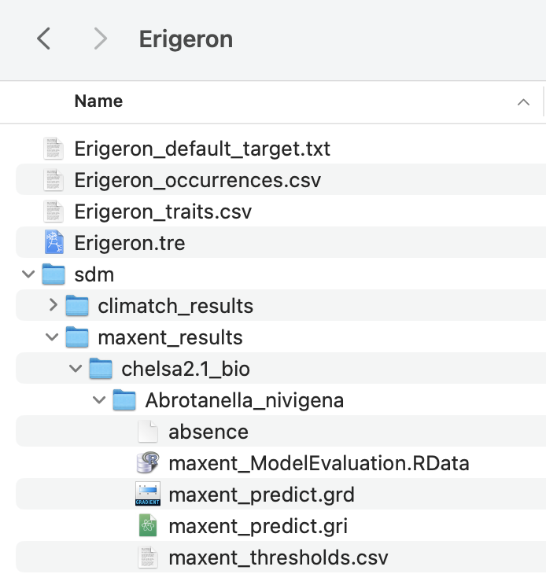

<!-- README.md is generated from README.Rmd. Please edit that file -->

# `phylocontrol-viz` 

<!-- badges: start -->

[](https://lifecycle.r-lib.org/articles/stages.html#stable)
[](https://www.gnu.org/licenses/gpl-3.0)

<!-- badges: end -->

A phylogeny and spatial data visualisation interface for risk analysis
and decision support in weed biological control.

## Introduction

PhyloControl is a user-friendly visualisation tool to aid biocontrol
researchers in their decision-making during risk analysis. Thorough
host-specificity testing is crucial to minimise the risk of off-target
damage by biocontrol agents to native and economically important plant
species. To facilitate this, host test lists need to be developed from
an understanding of evolutionary relationships. The process of obtaining
a host test list is currently not standardised, and the manual steps may
be time-consuming and challenging. PhyloControl integrates taxonomic
data, molecular data, spatial data, and plant traits in an intuitive
interactive interface, empowering biocontrol practitioners to summarise,
visualise, and analyse data efficiently.

This repository, `phylocontrol-viz`, contains the code for the R Shiny
visualisation application. Inputs for visualisation may be generated
using the Quarto notebooks provided in the [phylocontrol-geninput
repository](https://github.com/csiro/phylocontrol-geninput).

## Demo server

Try out the [demo version of the PhyloControl visualisation
app](https://shiny.csiro.au/phylocontrol-viz-demo/).

## Installation

You can install the development version of `{phylocontrol.viz}` like so:

``` r
install.packages('devtools')
devtools::install_github("csiro/phylocontrol-viz")
```

Note that the repository name contains dashes while the package contains
a dot.

## Run

You can launch the application by running:

``` r
# Demo
phylocontrol.viz::run_app(demo = TRUE)

# With own data (demo parameter is FALSE by default)
phylocontrol.viz::run_app(dir_path = "insert local path to data here")
```

It is recommended to copy the output files needed for the PhyloControl
visualisation application into a separate directory set up specifically
for the visualisation app which contains a folder for each study group
e.g. `App_data/Erigeron/`. See below for directory structure and naming
conventions.

<p align="center">



</p>

You can also optionally add a text file containing the default target
weed (otherwise the app with default to the first species alphabetically
as the target, but a selection can still be made in the app). The user
can also create a csv file containing traits to visualise with heatmaps.
For an example of this directory structure, have a look at the App_data
folder in the [supplementary data for the
manuscript](https://doi.org/10.25919/21fr-hk78).

## Inputs for visualisation

A number of inputs can be visualised across the Phylogeny, Map, Model,
and Report tabs available in the visualisation app.

| File                               | Tab       | Requisite | Description                                                                                                                                                                                                                                                                                                                                                                                                                          |
|:-----------------------------------|:----------|:----------|:-------------------------------------------------------------------------------------------------------------------------------------------------------------------------------------------------------------------------------------------------------------------------------------------------------------------------------------------------------------------------------------------------------------------------------------|
| `{study_group}.tre`                | Phylogeny | Required  | The phylogenetic tree data in the text-based Newick format. Can be created via the Quarto notebooks.                                                                                                                                                                                                                                                                                                                                 |
| `{study_group}_traits.csv`         | Phylogeny | Optional  | Table of trait data, usually categorical, but not limited to, with a column for each trait. The first column should have the header `Species_` and the rows should contain all the species in the tree as scientific names with underscores between the genus and species. All character names (column headers) and states (variables in rows) must be unique. Blanks or NAs are allowed. This file is manually created by the user. |
| `{study_group}_default_target.txt` | Phylogeny | Optional  | Text file defining the target species name to highlight in the app. Defaults to the first species alphabetically if missing.                                                                                                                                                                                                                                                                                                         |
| `{study_group}_occurrences.csv`    | Map       | Optional  | Occurrence data with latitude and longitude in decimal degrees. Required columns: `species`, `decimalLatitude`, `decimalLongitude`, and `country`. This file should be created via the Quarto notebooks to ensure correct format.                                                                                                                                                                                                    |
| `sdm/climatch_results`             | Model     | Optional  | Species distribution modelling files using the CLIMATCH method. Key file: `climatch_predict.grd`. Can be created via the Quarto notebooks.                                                                                                                                                                                                                                                                                           |
| `sdm/maxent_results`               | Model     | Optional  | Species distribution modelling files using the MaxEnt method. Key files: `maxent_predict.grd` and `maxent_thresholds.csv`. Can be created via the Quarto notebooks.                                                                                                                                                                                                                                                                  |

**Notes on the trait file**

Traits that may be useful in biocontrol risk assessment may include any
morphological or lifecycle characteristics that may influence the
likelihood of a candidate control agent affecting non-target organisms.
If a non-target species shares key traits with the target weed, it may
be more susceptible to unintended impacts. Therefore, practitioners may
find it useful to visualise traits such as leaf succulence, woody stems,
flowering time, or fruit type alongside the phylogeny. While
PhyloControl provides the functionality to do so, there is no central
repository for such traits. Therefore, a trait file in csv format has to
be manually created by the user.

If there is a column with the header `Species` in the trait file, it
will be ignored by the application. It is crucial to have a column with
the header `Species_` in the trait file where there are no spaces in the
names (only underscores). If you used the Quarto notebook to create the
species list, then column with scientific names may be copied over and
modified for the trait file. Alternatively, you could extract all the
tip names from the phylogenetic tree file to create the trait file.

If the legend for the traits in heatmaps are displaying not as expected,
check that they are coded in a way that can be understood by the
application. For example, the following is not ideal as the same
variable levels are being used across multiple traits. It is fine to
have both NA and blanks in the trait file. It is also fine to have
spaces in the headers and variables.

| Species\_      | Native | Leaf.hairs | Horticultural |
|:---------------|:-------|:-----------|:--------------|
| Genus_species1 | yes    | yes        | NA            |
| Genus_species2 | no     | no         | yes           |
| Genus_species3 | no     |            | no            |

Instead, the table is better coded as follows where the character and
state names are unique:

| Species\_      | Status     | Leaf hairs       | Horticultural |
|:---------------|:-----------|:-----------------|:--------------|
| Genus_species1 | Native     | Abaxially woolly | NA            |
| Genus_species2 | Introduced | Glabrous         | Yes           |
| Genus_species3 | Introduced |                  | No            |

**Notes on outgroup rooting**

The phylogeny should be outgroup rooted for use with PhyloControl. The
outgroup are species that are known to be more distantly related than
everything else in the tree. This means that the root is at the point
where the outgroup(s) join the rest of the tree (the ingroup). Rooting
can be done via the sidebar of the Phylogeny tab and the resulting
phylogeny may be exported as a Newick file. It is important that you do
*not* root the tree on your target weed species, as this will result in
incorrect inferences being drawn from the data.

## Code of Conduct

Please note that `{phylocontrol.viz}` is released with a [Contributor
Code of
Conduct](https://contributor-covenant.org/version/2/1/CODE_OF_CONDUCT.html).
By contributing to this project, you agree to abide by its terms.

## About

This package was made using `{golem}` and you are reading about version
1.0.0 .

This README was compiled on:

    #> [1] "2025-06-16 16:06:47 AEST"

<!-- Here are the tests results and package coverage: -->
<!-- ```{r, error = TRUE} -->
<!-- devtools::check(quiet = TRUE) -->
<!-- ``` -->
<!-- ```{r echo = FALSE} -->
<!-- unloadNamespace("phylocontrol.viz") -->
<!-- ``` -->
<!-- ```{r, error = TRUE} -->
<!-- covr::package_coverage() -->
<!-- ``` -->

## Citing PhyloControl

The PhyloControl paper is currently in review. For now, please cite the
[pre-print on bioRxiv](https://doi.org/10.1101/2025.06.11.658203).

> Stephanie H. Chen, Lauren Stevens, Ben Gooden, Michelle A. Rafter,
> Nunzio Knerr, Peter H. Thrall, Louise Ord, Alexander N. Schmidt-Lebuhn
> (2025). PhyloControl: a phylogeny visualisation platform for risk
> analysis in weed biological control. bioRxiv. DOI:
> [10.1101/2025.06.11.658203](https://doi.org/10.1101/2025.06.11.658203)
